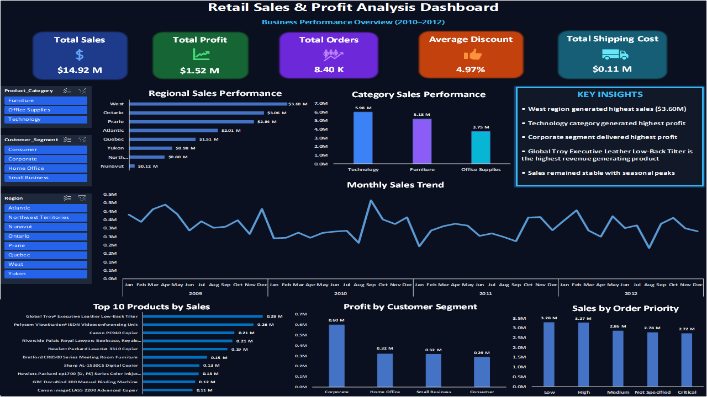

# RetailIQ Sales & Profit Analysis

## Project Overview

This project analyzes retail sales data to identify key business insights related to sales, profit, customer segments, products, and regional performance.

## Tools Used

- Microsoft Excel
- Pivot Tables
- Pivot Charts
- Slicers
- Dashboard Design

---

## Data Cleaning

The following data cleaning steps were performed:

- Removed duplicate records
- Handled missing values
- Standardized date formats
- Verified data types
- Cleaned and validated the dataset

---

## Key Performance Indicators (KPIs)

| KPI | Value |
|------|------|
| Total Sales | $14.92 Million |
| Total Profit | $1.52 Million |
| Total Orders | 8,399 |
| Average Discount | 4.97% |
| Total Shipping Cost | $0.11 Million |

---

## Business Insights

### 1. Highest Sales Region
West Region generated the highest sales with approximately $3.60 Million in revenue.

### 2. Most Profitable Product Category
Technology was the most profitable product category.

### 3. Highest Revenue Product
Global Troy Executive Leather Low-Back Tilter generated the highest revenue with approximately $0.28 Million in sales.

### 4. Highest Profit Customer Segment
Corporate customers generated the highest profit with approximately $0.60 Million.

### 5. Monthly Sales Trend
Monthly sales remained stable with periodic seasonal peaks, indicating consistent business performance.

---

## Dashboard Preview

---

## Project Files

- Retail_Analysis.xlsx
- Dashboard.png
- Project_Summary.docx
- Cleaned_Data.xlsx
- Raw_Data.xlsx

---

## Author

Akshaya pasupuleti

